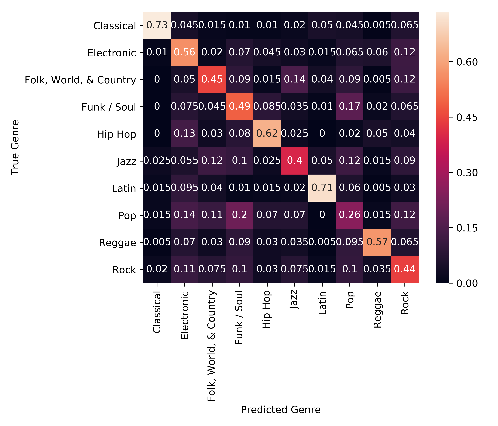

# Can you guess genre based on an album's tracklist?

Trying to assign a genre to a new album or backdate albums with missing genres can be tricky. What if your favourite artist is transitioning from folk to electronic?  Or you're wondering if that bargain bin LP in your hand is more reggae or funk? Everyone is using up the record players to listen... Can we guess the genre by browsing the tracklist?

Using the Discogs [API](https://www.discogs.com/developers/) I grab 1000 random artists per genre for Discogs' top 10 genres, and their respective tracklists.  I use [XGBoost](https://xgboost.readthedocs.io/en/latest/) for the classification and [ELI5](https://eli5.readthedocs.io/en/latest/) to visualise the model's features.  Let's take a look!

[Here's](http://htmlpreview.github.io/?https://github.com/rkhood/discogs/blob/master/eli5_prediction.html) the ELI5 prediction for a [Bob Dylan album](https://www.discogs.com/Bob-Dylan-Bringing-It-All-Back-Home/release/3307333) in the test set, and [here's](http://htmlpreview.github.io/?https://github.com/rkhood/discogs/blob/master/eli5_weights.html) a few feature weights.
